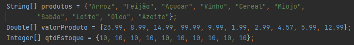
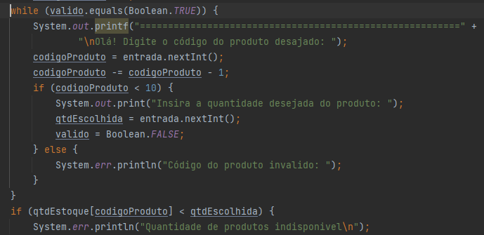
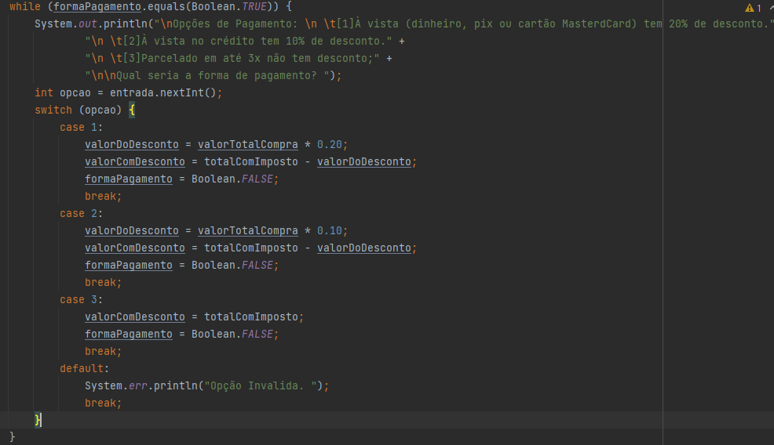
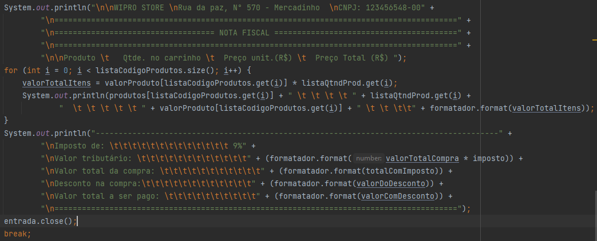

# Desafio Loja Virtual com Carrinho de Compras

# Grupo:
* Marllon Zucolotto
* Paulo Henrique
* Leanderson Lima
* Pedro Chaves
* Roberto Brito

 **A ideia do projeto é um Carrinho de Compras.**

**Requisitos:**

**A nossa loja deve conter um estoque:**

Essa lógica foi feita usando um array de String para armazenar o produto, um array de Integer para armazenar a quantidade e um array de double para armazenar o valor.

**Caso produto esteja indisponível deve retornar a mensagem para o cliente “Produto Indisponível”:**

Foi usado while e if para ver se o código do produto é válido e se ainda contém em estoque, se caso não tiver vai retornar uma mensagem de erro dizendo que "Quantidade de produtos indisponivel".

**Deverá ter 3 formas de pagamento:**

Para mostrar as opções de pagamento, foi usado um while com switch case para cada caso, pix, dinheiro, cartão, à vista crédito ou até parcelado.

**Deve retornar a nota fiscal com o valor pago de tributos de 9% sobre a compra (Esse valor não deve ser
somado ao total do carrinho, somente ser exibido na nota fiscal):**

Foi criado uma variável de nome valorTotalComImposto para armazenar o valor total da compra, vezes(x) o imposto. Dessa forma é possivel descobrir o valor do imposto sobre a compra, podendo acrescentar o valor total do imposto no valor total da compra.

**Falando sobre o trabalho em equipe, foi bem produtivo para todos, todos tiveram ideias especificas sobre como deveriam fazer tal ponto. Ficamos discutindo horas sobre o projeto e compartilhando conhecimento, até mesmo nos conhecendo mais, falando do lado pessoal. No mais, nosso trabalho foi ótimo.**   

