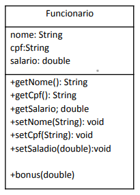

# Exercícios POO
1) Crie uma classe Televisao e uma classe ControleRemoto que pode controlar o volume e
   trocar os canais da televisão. O controle de volume permite:
   ▪ aumentar ou diminuir a potência do volume de som em uma unidade de cada vez;
   ▪ aumentar e diminuir o número do canal em uma unidade
   ▪ trocar para um canal indicado;
   ▪ consultar o valor do volume de som e o canal selecionado.

2) Escreva uma classe cujos objetos representam alunos matriculados em uma disciplina.
   Cada objeto dessa classe deve guardar os seguintes dados do aluno: matrícula, nome,
   2 notas de prova e 1 nota de trabalho. Escreva os seguintes métodos para esta classe:
   ▪ Media: calcula a média final do aluno (cada prova tem peso 1,5 e o trabalho tem
   peso 2)
   ▪ Recuperação: calcula se a Media é maior do que 7 (retorna zero se ele não for para
   a recuperação)

3) Dada a interface FormaGeometrica:

   

   Crie as classes que representem: círculo, retângulo, quadrado e triangulo retângulo,
   implementando a interface FormaGeometrica e crie métodos para o cálculo da área
   especifico de cada forma geométrica;

4) Dada a Classe Funcionário:

   

Crie 2 tipos distintos de funcionários, cada um com seus respectivos bônus.

