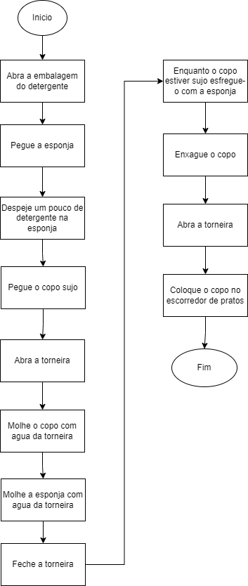

 # Logica de Programação

1 - Faça um algoritmo que mostre o passo a passo para trocar uma de lâmpada queimada.

      
        1-	Pegue uma escada no quartinho
        2-	Coloque a escada abaixo da lâmpada a ser trocada
        3-	Desligue o interruptor de energia
        4-	Suba a escada
        5-	Desrosqueie a lâmpada queimada do soquete
        6-	Desça a escada com a lâmpada queimada em mãos
        7-	Descarte a lâmpada queimada em local adequado
        8-	Pegue a lâmpada nova na gaveta
        9-	Retire a lâmpada nova da embalagem
        10-	Suba a escada com lâmpada nova em mãos
        11-	Rosqueie a lâmpada nova no soquete
        12-	Desça a escada
        13-	Ligue o interruptor
        14- 	Se acender
        15-	fim da atividade
        16-		Senao
        17-		volte a linha 3

  2 - Faça um algoritmo que mostre o passo a passo para passear com seu animal de estimação.

        1-	Pegue a coleira, guia e saco para sujeira
        2-	Coloque a coleira no animal
        3-	Engate a guia na coleira
        4-	Abra a porta
        5-	Saia com o animal
        6-	Feche e tranque a porta
        7-	Passeie com o animal
        8-	Se animal fizer sujeira
        9-	recolha com o saco e descarte na lixeira
        10-		Senao continue o passeio
        11-	Após o passeio retorne para casa
        12-	Fim

  3 - Faça um algoritmo que mostre o passo a passo para acessar um computador.

        
        1-	Conecte o cabo de energia do computador na tomada
        2-	Aperte o botão de ligar
        3-	Aguarde abrir a tela de login
        4-	Digite usuário e senha
        5-	Clique em login
        6-	Execute suas atividades no computador
        7-	Fim

  4 - Faça um algoritmo que mostre o passo a passo para lavar um copo

  

  5 - Faça um algoritmo que mostre o passo a passo para postar uma foto em um rede social

        1-	Pegue o celular
        2-	Desbloqueie o celular
        3-	Abra a rede social desejada (Instagram)
        4-	Se estiver logado
        5-	siga para a linha 9
        6-		Senao
        7-		Digite usuario e senha
        8-		Faça o login
        9-	Clique no botão quadrado com o símbolo mais (+)
        10-	Clique em publicar
        11-	Escolha a foto que deseja
        12-	Clique em nova publicação
        13-	Clique na seta em azul para publicar
        14-	Fim
